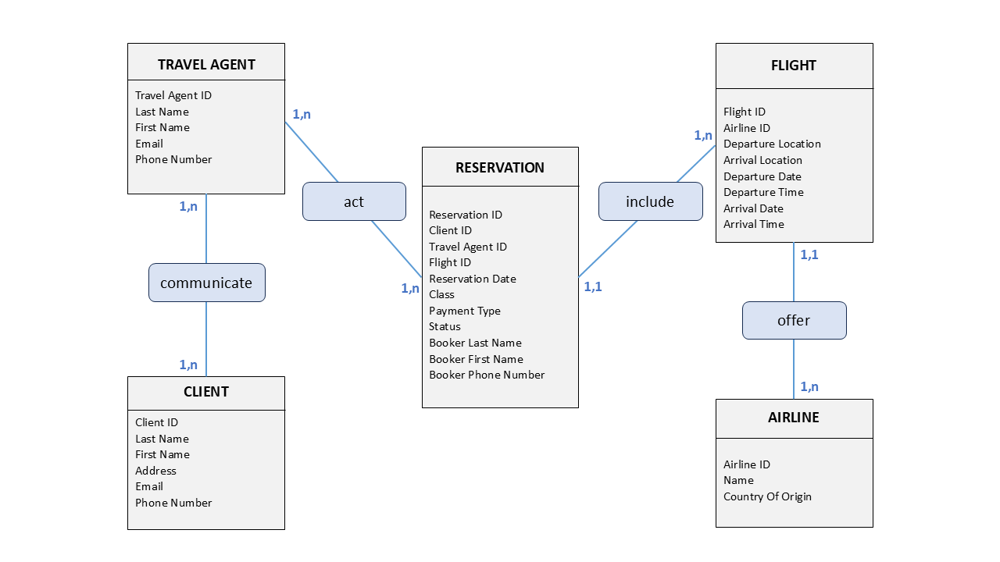

<div align="center">
  <h1> Travel Agency Reservation Management</h1>
</div>

## Introduction

This JavaFX application is designed as **a dedicated workspace for travel agency staff**.  
It allows them to easily manage client reservations while accessing pre-filled flight and airline information, which is updated by the administration.  

The application is based on a **MySQL database** and offers different levels of access:  
- **Travel agents** manage clients and their reservations only.  
- **The administration** controls flights, airlines, and agency personnel.  

## Conceptual Data Model (CDM)

Here is the structure of the project's main entities:



Reservations are the central element of the model, linked to clients, travel agents, and flights via foreign keys.  
Each reservation is associated with a client who books it, a travel agent who manages it, and a corresponding flight.

## Features

Travel agents can:  
- Add, modify, or cancel a client's reservation.  
- View available flights and operating airlines.  
- Access a global view of reservations in Excel format.  
- Manage clients and track their travel history.  

---

## 📂 Project Structure

```plaintext
docker/                 → MySQL container configuration
├── docker-compose.yml  → Database deployment
├── initialization.sql  → SQL initialization script

src/                    → Project source code
├── config/             → MySQL connection management
│   ├── DatabaseConnection.java
│   ├── test.java
├── models/             → Entity definitions
│   ├── Client.java
│   ├── TravelAgent.java
│   ├── Airline.java
│   ├── Flight.java
│   ├── Reservation.java
├── dao/                → Data access (CRUD operations)
│   ├── ClientDAO.java
│   ├── TravelAgentDAO.java
│   ├── AirlineDAO.java
│   ├── FlightDAO.java
│   ├── ReservationDAO.java
├── fx/                 → JavaFX graphical interface
│   ├── ClientFX.java
│   ├── TravelAgentFX.java
│   ├── AirlineFX.java
│   ├── FlightFX.java
│   ├── ReservationFX.java
│   ├── ExcelViewFX.java
│   ├── Main.java       → Main application class

executable.jar          → Executable file to launch the application

