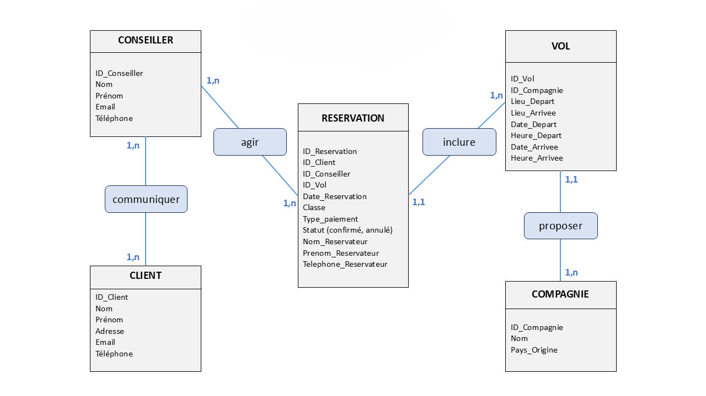
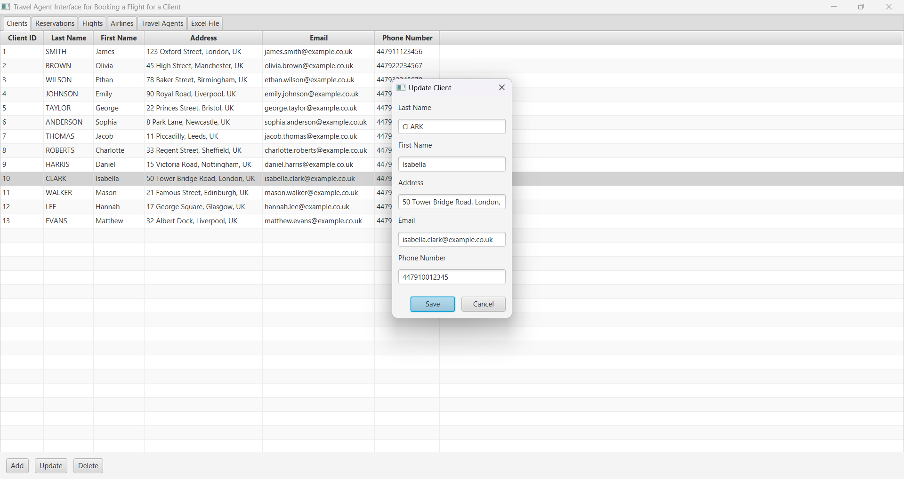
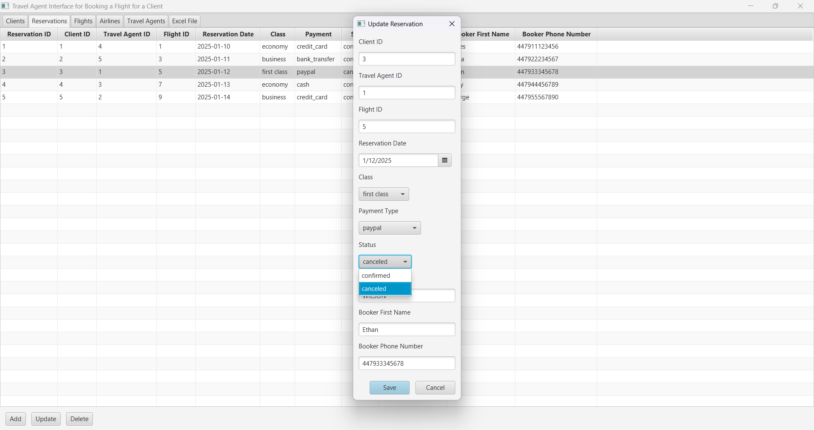

<div align="center">
  <h1> Gestion des Réservations - Agence de Voyage</h1>
</div>



## Introduction

Cette application JavaFX est conçue comme **un espace de travail dédié aux conseillers** d'une agence de voyage.  
Elle leur permet de gérer facilement les réservations des clients, en accédant aux informations préremplies sur les vols et compagnies aériennes, qui sont mises à jour par l'administration.  

L’application repose sur une **base de données MySQL** et offre un accès différencié :  
- **Les conseillers** gèrent uniquement les clients et leurs réservations.  
- **L’administration** contrôle les vols, compagnies et conseillers de l'agence de voyage.  

## Fonctionnalités

Les conseillers peuvent :  
- **Ajouter, modifier ou annuler une réservation** pour un client  
- **Consulter les vols disponibles** et les compagnies opératrices  
- **Accéder à une vue globale des réservations sous format Excel**  
- **Gérer les clients et suivre leur historique de voyage**  

---

## 📂 Arborescence du projet 

```plaintext
docker/                → Configuration du conteneur MySQL
├── docker-compose.yml → Déploiement de la base de données
├── initialization.sql  → Script d'initialisation SQL

src/                   → Code source du projet
├── config/            → Gestion de la connexion MySQL
│   ├── DatabaseConnection.java
│   ├── test.java
├── models/            → Définition des entités 
│   ├── Client.java
│   ├── TravelAgent.java
│   ├── Airline.java
│   ├── Flight.java
│   ├── Reservation.java
├── dao/               → Accès aux données (CRUD)
│   ├── ClientDAO.java
│   ├── TravelAgentDAO.java
│   ├── AirlineDAO.java
│   ├── FlightDAO.java
│   ├── ReservationDAO.java
├── fx/                → Interface graphique en JavaFX
│   ├── ClientFX.java
│   ├── TravelAgentFX.java
│   ├── AirlineFX.java
│   ├── FlightFX.java
│   ├── ReservationFX.java
│   ├── ExcelViewFX.java
│   ├── Main.java      → Classe principale

executable.jar         → Fichier exécutable pour lancer l’application
```

---

## Commandes Docker

**Démarrer la base de données MySQL**  
```bash
docker-compose up -d
```

**Accéder à MySQL dans le conteneur**  
```bash
docker exec -it project_travel_agency mysql -u project_travel_agency -p      
```
ou
```bash
docker exec -it project_travel_agency mysql -u root -p
```

**Arrêter et supprimer le conteneur**  
```bash
docker-compose down
```

---

## 🖥️ Lancer l'interface JavaFX

### Méthode recommandée : Exécution depuis Eclipse  
L'interface graphique peut être lancée directement depuis **l'IDE Eclipse**, ce qui constitue la solution la plus simple :  
1. **Ouvrir le projet dans Eclipse**  
2. **Ajouter les bibliothèques requises** :  
   - Télécharger **JavaFX SDK** depuis [le site officiel](https://openjfx.io/)  
   - Télécharger le **connecteur MySQL** depuis [le site officiel](https://www.mysql.com/products/connector/)  
   - Ajouter ces bibliothèques au projet via **Build Path → Configure Build Path → Add External JARs**  
3. **Sélectionner `Main.java` dans le package `fx`**  
4. **Cliquer sur "Run"** pour exécuter l’application  


### Exécution depuis le terminal  
L’application peut également être exécutée en dehors de l’IDE avec la commande suivante :  
```bash
java -p "javafx-sdk-23.0.1/lib" --add-modules javafx.controls,javafx.base,javafx.fxml,javafx.graphics,javafx.media,javafx.web --add-opens=javafx.graphics/javafx.scene=ALL-UNNAMED --add-exports javafx.base/com.sun.javafx.event=ALL-UNNAMED -jar executable.jar
```

---

## 📖 Consultation des documentations
Deux rapports détaillés du projet sont disponibles :  

**Version française** : [Lire le rapport en français](rapport_gestion_reservations.pdf)  
**Version anglaise** : [Read the report in English](English_version/reservations_management_report.pdf)  

---

## 📸 Aperçu de l'Application

### Interface d’accueil  


### Onglet des réservations  


### Onglet des vols  


### Onglet des compagnies aériennes  


### Onglet des conseillers  


### Onglet Excel  


---


**Pour cloner et démarrer ce projet**  
```bash
git clone https://github.com/rmdair/Gestion_Reservations_JavaFX.git
```
```bash
cd Gestion_Reservations_JavaFX
```
