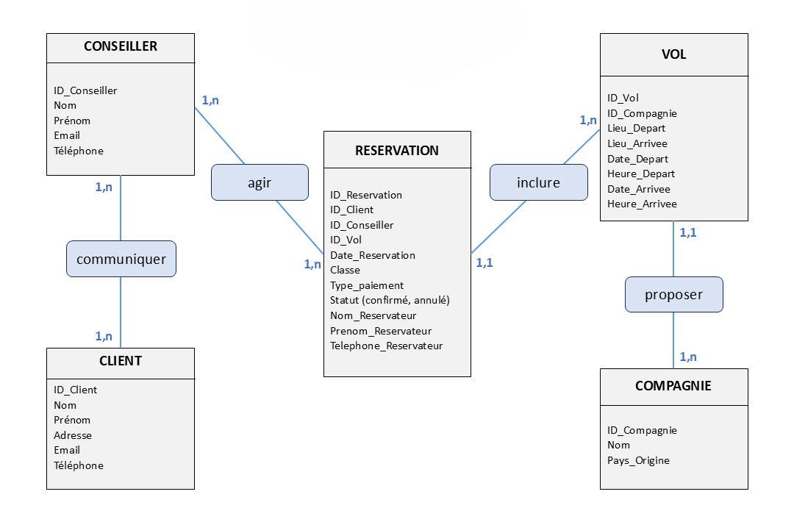
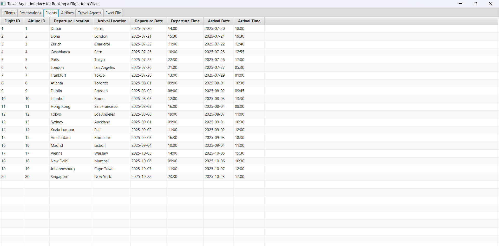
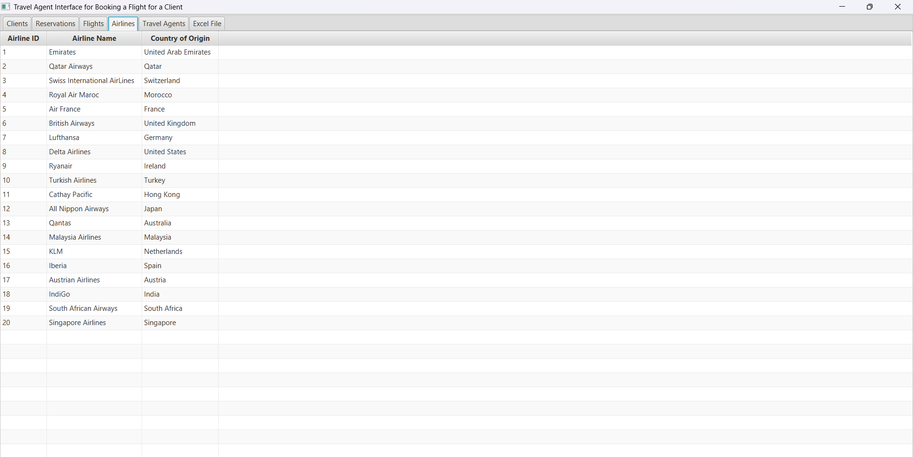
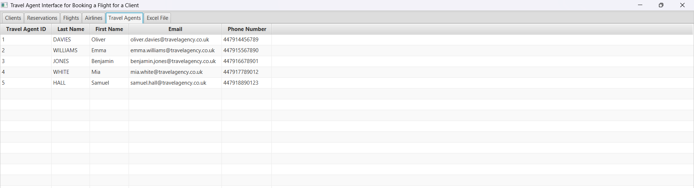
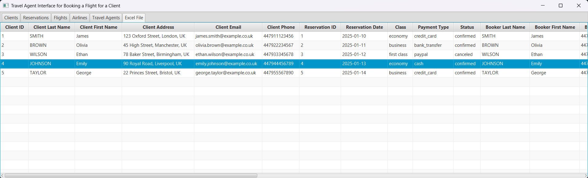

<div align="center">
  <h1>Gestion des réservations – Agence de voyage</h1>
  &nbsp;

 
 

</div>      

<p align="center">
  
</p>

## Introduction

Cette application JavaFX est conçue comme un espace de travail dédié aux conseillers d'une agence de voyage.  
Elle leur permet de gérer facilement les réservations des clients, en accédant aux informations préremplies sur les vols et les compagnies aériennes, mises à jour par l'administration.  

L’application repose sur une **base de données MySQL relationnelle** et offre un accès différencié :  
- **Les conseillers** gèrent uniquement les clients et leurs réservations.  
- **L’administration** gère les vols, les compagnies aériennes et les conseillers.

&nbsp;

## Téléchargement

Vous pouvez télécharger la version stable prête à l'emploi ici :

<p align="center">
  <a href="https://github.com/rmdair/Gestion_Reservations_JavaFX/releases/tag/v1.0.0">
    
  </a>
</p>

&nbsp;

## Modèle conceptuel de données (MCD)

Voici la structure des principales entités du projet :

<p align="center">
  
</p>

Les réservations constituent l'élément central du modèle. 
Chacune d'entre elles est associée au client qui l'effectue, au conseiller qui la gère, ainsi qu’au vol correspondant.

&nbsp;

## Fonctionnalités

Les conseillers peuvent :  
- Ajouter, modifier ou annuler une réservation pour un client  
- Consulter les vols disponibles et les compagnies opératrices  
- Accéder à une vue globale des réservations au format Excel  
- Gérer les clients et suivre leur historique de voyage  

&nbsp;

## 📂 Arborescence du projet 

```plaintext
docker/                → Configuration du conteneur MySQL
├── docker-compose.yml → Déploiement de la base de données
├── initialization.sql → Script d'initialisation SQL

src/                   → Code source du projet
├── config/            → Gestion de la connexion MySQL
│   ├── DatabaseConnection.java
│   ├── test.java
├── models/            → Définition des entités 
│   ├── Client.java
│   ├── TravelAgent.java
│   ├── Airline.java
│   ├── Flight.java
│   ├── Reservation.java
├── dao/               → Accès aux données (CRUD)
│   ├── ClientDAO.java
│   ├── TravelAgentDAO.java
│   ├── AirlineDAO.java
│   ├── FlightDAO.java
│   ├── ReservationDAO.java
├── fx/                → Interface graphique en JavaFX
│   ├── ClientFX.java
│   ├── TravelAgentFX.java
│   ├── AirlineFX.java
│   ├── FlightFX.java
│   ├── ReservationFX.java
│   ├── ExcelViewFX.java
│   ├── Main.java      → Classe principale
```

&nbsp;

## Commandes Docker

**Démarrer la base de données MySQL**  
```bash
docker-compose up -d
```

**Accéder à MySQL dans le conteneur**  
```bash
docker exec -it project_travel_agency mysql -u project_travel_agency -p      
```
ou
```bash
docker exec -it project_travel_agency mysql -u root -p
```

**Arrêter et supprimer le conteneur**  
```bash
docker-compose down
```

&nbsp;

## 🖥️ Lancer l'interface JavaFX

### Méthode recommandée : exécution depuis Eclipse  
L'interface graphique peut être lancée directement depuis **l'IDE Eclipse**, ce qui constitue la solution la plus simple :  
1. **Ouvrir le projet dans Eclipse**  
2. **Ajouter les bibliothèques requises** :  
   - Télécharger **JavaFX SDK** depuis [le site officiel](https://openjfx.io/)  
   - Télécharger le **connecteur MySQL** depuis [le site officiel](https://www.mysql.com/products/connector/)  
   - Ajouter ces bibliothèques au projet via **Build Path → Configure Build Path → Add External JARs**  
3. **Sélectionner `Main.java` dans le package `fx`**  
4. **Cliquer sur Run** pour exécuter l'application  


### Exécution depuis le terminal  
L'application peut également être exécutée en dehors de l'IDE avec la commande suivante :  
```bash
java -p "javafx-sdk-23.0.1/lib" --add-modules javafx.controls,javafx.base,javafx.fxml,javafx.graphics,javafx.media,javafx.web --add-opens=javafx.graphics/javafx.scene=ALL-UNNAMED --add-exports javafx.base/com.sun.javafx.event=ALL-UNNAMED -jar executable.jar
```

&nbsp;

## 📖 Documentation
Deux rapports détaillés du projet sont disponibles :  

**Version française** : [Lire le rapport en français](docs/rapport_gestion_reservations.pdf)  
**Version anglaise** : [Read the report in English](English_version/docs/reservations_management_report.pdf)  

&nbsp;

## 📸 Aperçu de l'application

### Interface d'accueil
<p align="center">
  
</p>

### Onglet des réservations
<p align="center">
  
</p>

### Onglet des vols
<p align="center">
  
</p>

### Onglet des compagnies aériennes
<p align="center">
  
</p>

### Onglet des conseillers
<p align="center">
  
</p>

### Onglet Excel
<p align="center">
  
</p>

&nbsp;

## Pour cloner et démarrer ce projet  

```bash
git clone https://github.com/rmdair/Gestion_Reservations_JavaFX.git

cd Gestion_Reservations_JavaFX

# Lancer l'application (vérifiez que le chemin du SDK JavaFX est correct)
java -p "javafx-sdk-23.0.1/lib" --add-modules javafx.controls,javafx.base,javafx.fxml,javafx.graphics,javafx.media,javafx.web --add-opens=javafx.graphics/javafx.scene=ALL-UNNAMED --add-exports javafx.base/com.sun.javafx.event=ALL-UNNAMED -jar executable.jar
```

